```{r setup, include=FALSE}
options(htmltools.dir.version = FALSE)
options(servr.daemon = TRUE)
options(DT.options = list(bPaginate = FALSE, fillContainer = TRUE, searching = FALSE, pageLength = 10, scrollY = 350))
library(dplyr)
```

# Background

What is a vignette?

> A vignette is a **long-form guide** to your package. Function documentation is great if you know the name of the function you need, but it’s useless otherwise. A vignette is **like a book chapter or an academic paper**: it can describe the **problem that your package is designed to solve**, and then show the reader **how to solve it**.

.pull-right[
 -- Hadley Wickham, R Packages
]

To me, this should be distinct from a `README.md` (though there certainly may be overlap).

---

# `README`

When I think of `README`...

--

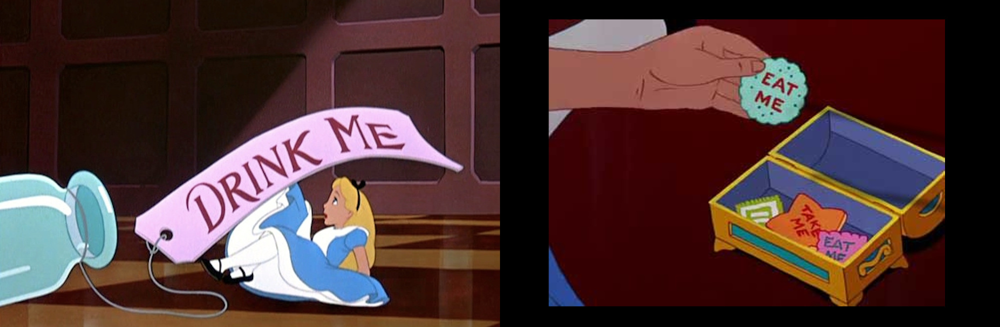

--

.large["READ ME FIRST"]

---

# `README`

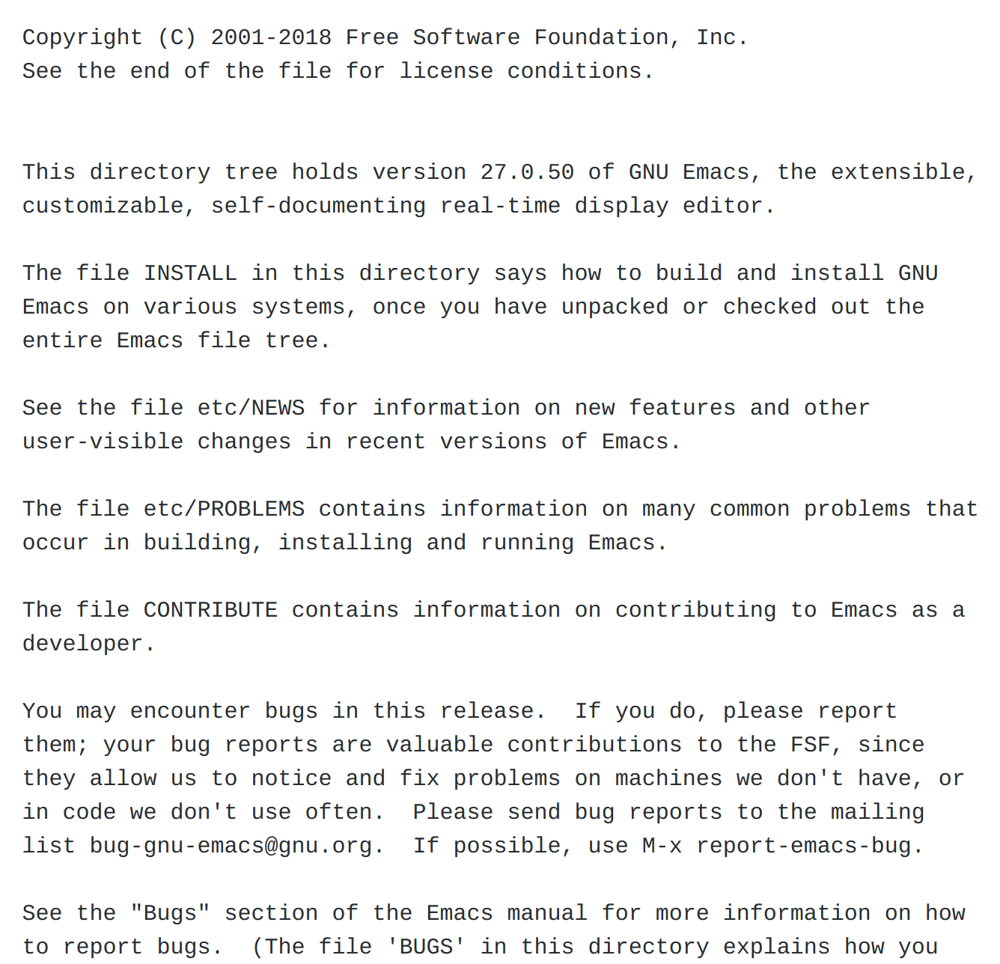

---

# `README`

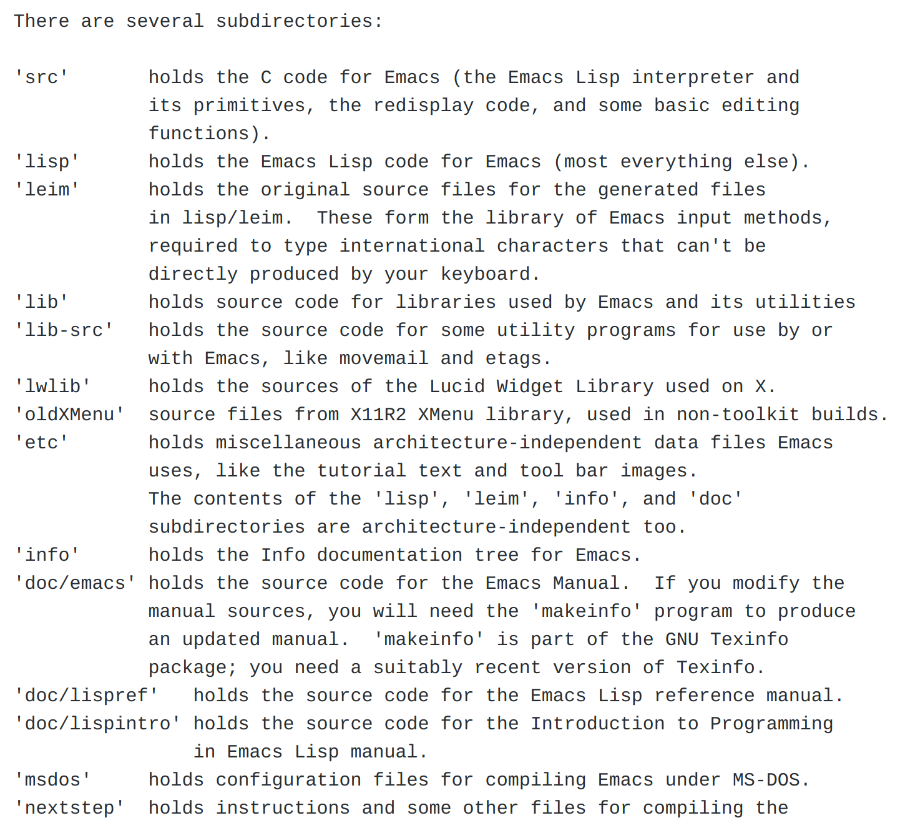

---

# Favourite features

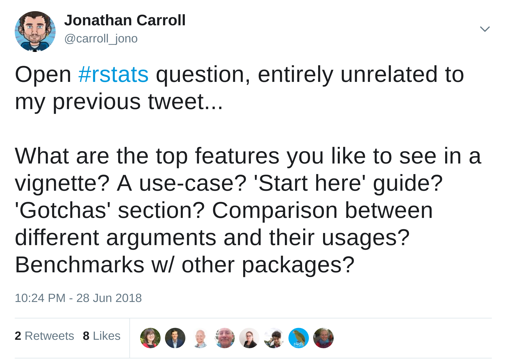

---

# Favourite features

 - worked examples
 - how multiple functions fit together
 - real-world examples
 - when to use functions
 - how to change things/variations of arguments
 - comparison with similar packages
 - how to get started

---

# Show of hands

_Who has an R package (CRAN/GitHub/GitLab/Bitbucket/personal)?_

--

_Keep them up if it has a vignette_

--

_Keep them up if you think it's sufficient for someone to get to know your package_

---

# fRiends, Romans, countRymen...

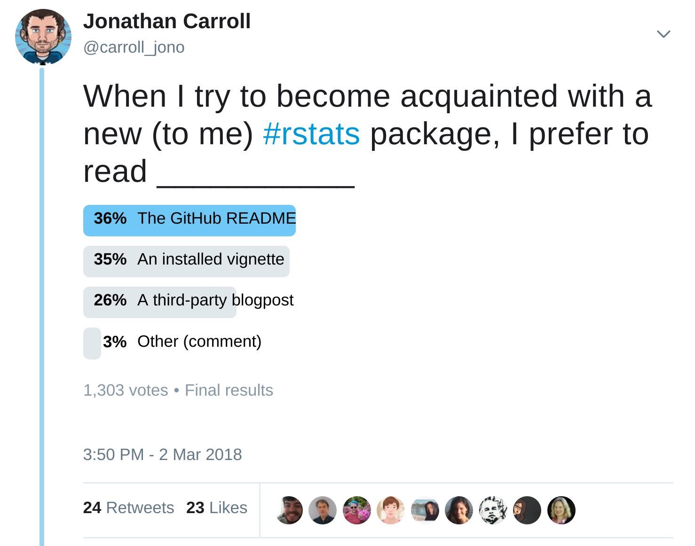

---

# Why Vignettes?

.pull-left[
 Vignette(s)

 - .green[Can be separated into logical pages]
  
<!-- -->

 - .green[Is rendered as part of the build -- never out of date]
 
<!-- -->

 - .green[Installed with the package, always available]
 
<!-- -->

 
 - .red[Requires navigating to the file, can be overlooked]

<!-- -->

 - .red[Dev needs to know how to write one] 

]

.pull-right[
 `README.md`
 
 - .red[Only a single file, possibly with sections]  
 

<!-- -->

 - .red[Is rendered on-demand, can become stale]
 
<!-- -->

 - .red[Only available online (e.g. GitHub/GitLab/Bioconductor)]
 
<!-- -->

 - .green[Is part of the 'landing page', prime visibility]

<!-- -->

 - .green[A title and a badge may be good enough] 

]

---

# Prior Art

The default template:

```{r, eval = FALSE}
---
title: "Vignette Title"
author: "Vignette Author"
date: "`r Sys.Date()`"
output: rmarkdown::html_vignette
vignette: >
  %\VignetteIndexEntry{Vignette Title}
  %\VignetteEngine{knitr::rmarkdown} #<<
  %\VignetteEncoding{UTF-8}
---
```

---

# Prior Art

`datapasta`

```{r, eval = FALSE}
Package: datapasta
Title: R Tools for Data Copy-Pasta
Version: 2.0.1
Authors@R: c(
    person("Miles", "McBain", email = "miles.mcbain@gmail.com", role = c("aut", "cre")),
    person("Jonathan", "Carroll", email = "jono@jcarroll.com.au", role = "aut"),
    person("Mark", "Dulhunty", role = "ctb"))
Description: RStudio addins and R functions that make copy-pasting vectors and tables to text painless.
[...]
License: MIT + file LICENSE
Encoding: UTF-8
LazyData: true
RoxygenNote: 6.0.1
URL: https://github.com/milesmcbain/datapasta
BugReports: https://github.com/milesmcbain/datapasta/issues
VignetteBuilder: knitr #<<
```

---

# Prior Art

Collect `DESCRIPTION` information directly from CRAN

```{r, cache = TRUE}
## MD5Sum is a repeated column
cran <- tools::CRAN_package_db()[, -65]

## lots of packages
nrow(cran)
```

How many of these have a `VignetteBuilder` set?

---
# Prior Art

Looking at how many packages use various `VignetteBuilder`

.pull-left[
```{r, eval = FALSE}
cran %>% 
  count(VignetteBuilder, 
        sort = TRUE) %>% 
  DT::datatable()
```

Packages which have a `Sweave` (built-in) 
vignette will have `VignetteBuilder = <NA>`, so 
we really want a way to search the _actual_ vignettes.

]

.pull-right[
```{r, echo = FALSE}
cran %>% 
  count(VignetteBuilder, 
        sort = TRUE) %>% 
  DT::datatable(options = list(bPaginate = FALSE, fillContainer = TRUE, searching = FALSE, pageLength = 10, scrollY = 350))
```
]

https://juliasilge.com/blog/mining-cran-description/

---

# CRAN Vignettes

What about entries which _include_ `knitr`?

```{r}
## how many mention knitr in VignetteBuilder?
cran %>% 
  select(Package, VignetteBuilder) %>% 
  unique() %>% 
  mutate(knitr_like = grepl("knitr", VignetteBuilder)) %>% 
  count(knitr_like, sort = TRUE)
```

---

# CRAN Vignettes

Count the actual vignettes in `/web/packages/<pkg>/vignettes/`

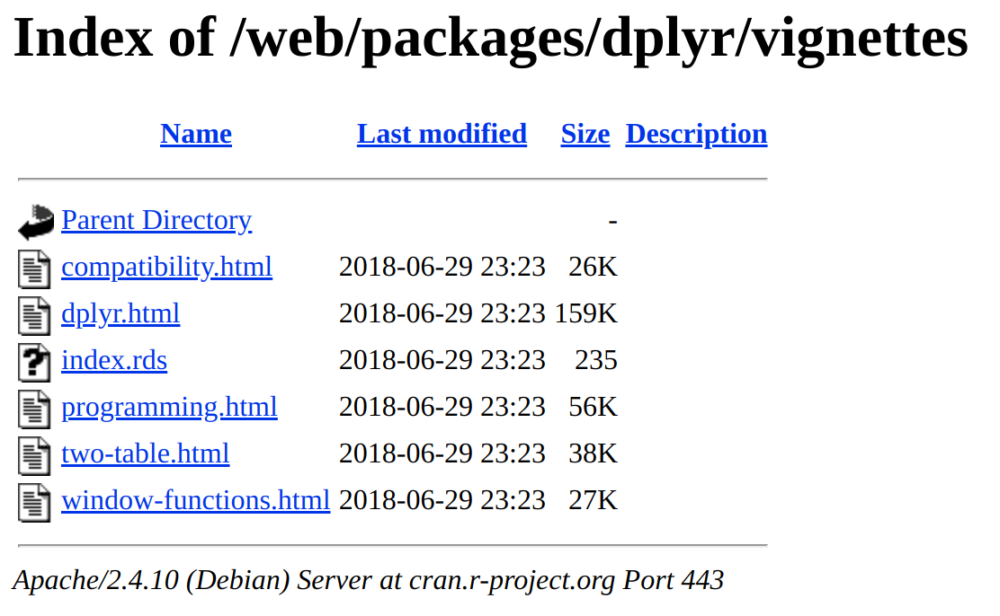

One _could_ scrape this ~12,000 times, or alternatively, ask someone with a local copy  
(shoutout: .red[`@hrbrmstr`])

---

# CRAN Vignettes

```{r, echo = FALSE, fig.width = 12}
vdata <- readRDS("data/pkg-vigs.rds")

nvig <- vdata %>% 
  count(pkg) %>% 
  arrange(desc(n))

nvig %>% 
  ggplot(aes(n)) +
  geom_histogram(binwidth = 0.5, fill = "steelblue") + 
  stat_count(aes(y=..count.., label=..count..), geom="text", vjust = -1) +
  coord_cartesian(xlim = c(1, 20), ylim = c(0, 6000)) + 
  scale_x_continuous(breaks = 1:20) + 
  scale_y_continuous(trans = "log1p", 
                     breaks = c(0, 10^{0:5})) +
  theme_bw() + 
  theme(text = element_text(size = 18)) +
  labs(title = "Number of vignettes in CRAN packages",
       subtitle = "(.pdf or .html)",
       x = "Number of vignettes",
       y = "Count of packages with n vignettes") + 
  theme(panel.grid.minor = element_blank())
```

---

# CRAN Vignettes

```{r, echo = FALSE, fig.width = 12}
nvig_type <- vdata %>% 
  group_by(vig_ext) %>% 
  count(pkg) %>% 
  arrange(desc(n))

nvig_type %>% 
  ggplot(aes(n, group = vig_ext, fill = vig_ext)) +
  geom_bar(position = position_dodge(width = 0.55), width = 0.55) + 
  # stat_count(aes(y=..count.., label=..count..), geom="text", vjust = -1, position = "dodge") +
  coord_cartesian(xlim = c(1, 20), ylim = c(0, 2000)) + 
  scale_x_continuous(breaks = seq(0, 20, 1)) + 
  scale_y_continuous(trans = "log1p", 
                     breaks = c(0, 10^{0:5})) +
  theme_bw() + 
  labs(title = "Number of vignettes in CRAN packages",
       subtitle = "(.pdf or .html)",
       x = "Number of vignettes",
       y = "Count of packages with n vignettes") +
  theme(panel.grid.minor = element_blank()) +
  theme(text = element_text(size = 18)) +
  # facet_wrap(~vig_ext) +
  scale_fill_manual(values = c("skyblue", "red3")) + 
  guides(fill = guide_legend(title = "Filetype"))
```

---

# Some great examples

`dplyr`

https://github.com/tidyverse/dplyr/blob/master/vignettes/programming.Rmd

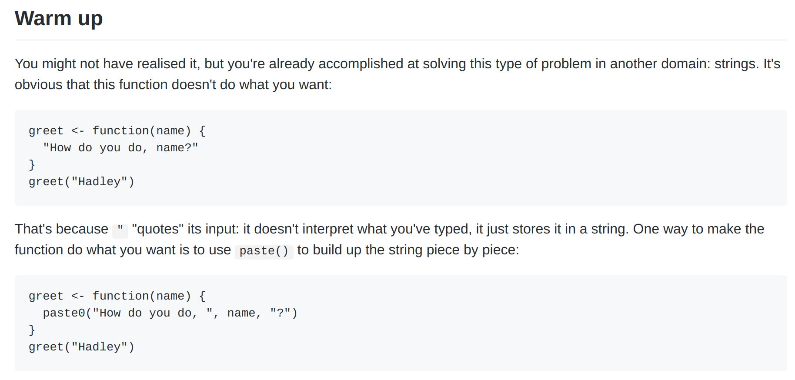

---

# Some great examples

`httr`

https://github.com/r-lib/httr/blob/master/vignettes/api-packages.Rmd

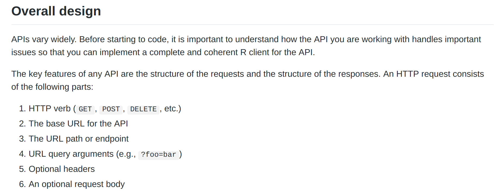

---

# Some great examples

`MultiAssayExperiment`

https://github.com/waldronlab/MultiAssayExperiment/blob/master/vignettes/MultiAssayExperiment.Rmd

https://github.com/waldronlab/MultiAssayExperiment/blob/master/vignettes/QuickStartMultiAssay.Rmd

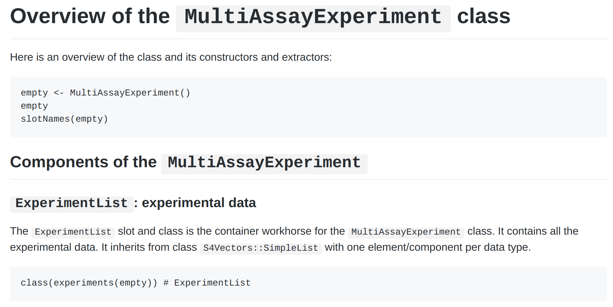

---

# Some great examples

`qicharts2`

https://github.com/anhoej/qicharts2/blob/master/vignettes/qicharts2.Rmd

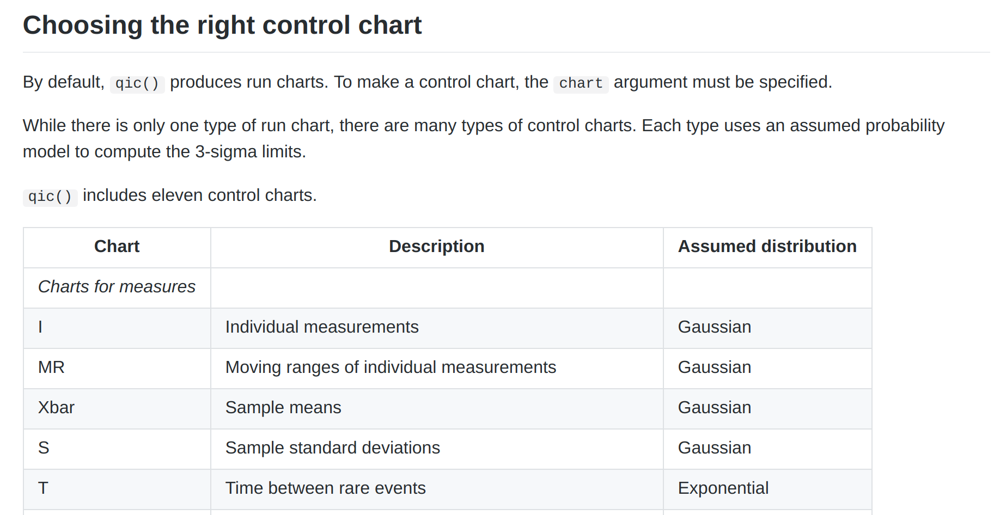

---

# Vignette vs `README`

In each of these cases, the `README.md` file is simple and effective.

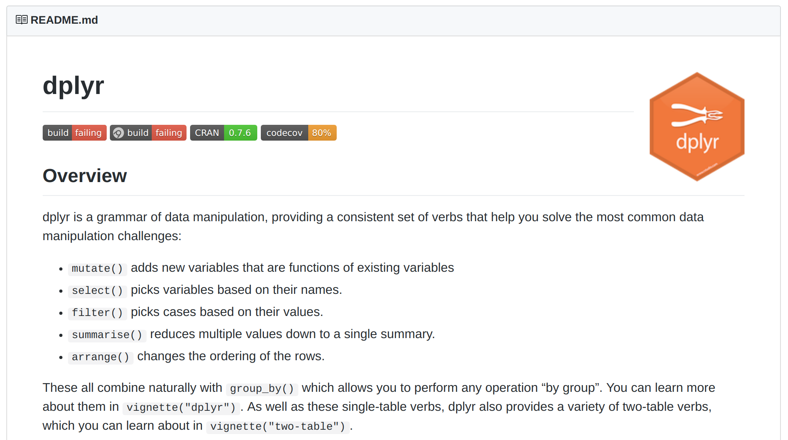

---

# `README` as a Makeshift Vignette

https://github.com/shabbychef/mazealls

---

# My Conclusion

<br/>

.large[More vignettes!]

---

# The offer

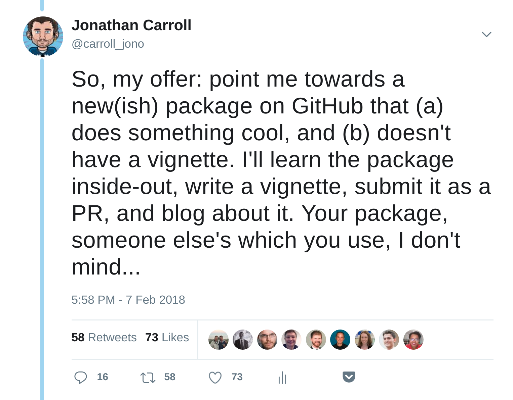

---

# What I first anticipated

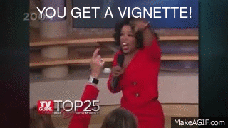

---

# What this isn't

---

# What I hope you take away

---

# The Program

---

# The Result


---

# Trying Another Angle

---

# xxxxx

---

# Which should I make?


---

# Where to now?


